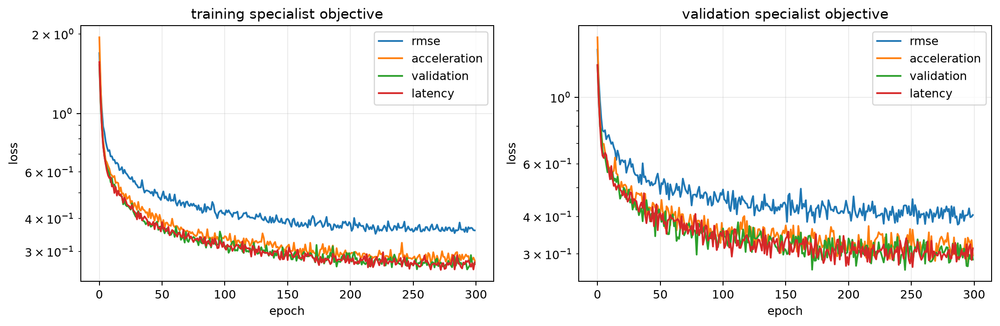

# Conditional Flow Matching for UR5 Trajectories

A research baseline for generating smooth, diverse UR5 joint-space trajectories conditioned on:

- start and goal joint configurations;
- a 2D obstacle occupancy map;
- an object pose `(x, y, yaw)`;
- task context (reach, push, or pick).

The model learns a conditional continuous vector field from collision-free RRT demonstrations. At inference, Gaussian trajectory noise is transported to an obstacle-aware trajectory by integrating the learned ODE.

## Why this project?

Robot motion generation must balance several competing requirements. A useful trajectory should
reach the requested goal, remain close to the demonstrated task behavior, move smoothly, avoid
unsafe configurations, and be generated quickly enough for deployment. A single model and a
single training loss do not necessarily optimize all of these properties equally well.

Conditional flow matching is attractive for this problem because it learns an entire distribution
of trajectories instead of predicting only one deterministic path. Starting from Gaussian noise,
the learned velocity field continuously transports a noisy trajectory toward a task-conditioned
motion. Different noise samples can therefore produce multiple valid solutions for the same start,
goal, and task context.

High-quality generative policies can nevertheless be expensive. An ensemble may improve robustness
by combining several models, but evaluating every teacher at every ODE integration step increases
latency and memory use. This project investigates whether that ensemble knowledge can be transferred
into one deployable student without losing trajectory quality.

## Generated robot positions

<table>
  <tr>
    <td align="center"><br><sub>Position 0</sub></td>
    <td align="center"><br><sub>Position 1</sub></td>
      <td align="center"><br><sub>Position 1</sub></td>

  </tr>
</table>

<table>
  <tr>
    <td align="center"><br><sub>Position 2</sub></td>
    <td align="center"><br><sub>Position 3</sub></td>
    <td align="center"><br><sub>Position 4</sub></td>
  </tr>
</table>

## Investigating on-policy distillation

The notebook trains several temporally structured convolutional teachers with different specialties:

- a reconstruction specialist focused on trajectory RMSE;
- a smoothness specialist focused on acceleration;
- a validation specialist focused on held-out flow performance;
- a latency/control specialist used to study the quality–runtime trade-off.

Their velocity predictions are combined into a teacher ensemble. The student is then trained using
three complementary signals:

1. **On-policy imitation:** the student begins from noise and visits its own intermediate flow
   states. The teacher ensemble labels those states with target velocities. This matters because
   small student errors can move inference away from the clean interpolation states encountered in
   ordinary supervised training.
2. **Demonstration-supervised flow matching:** real trajectories anchor the student to recorded
   behavior and prevent it from blindly inheriting every teacher error.
3. **Smoothness regularization:** finite joint/state acceleration discourages visibly jerky
   trajectories.

The main research question is whether one student can match the ensemble—and possibly outperform
its fixed average on some held-out metrics—while requiring only one model evaluation per ODE step.
To keep the comparison controlled, every specialist and the student uses the same temporal ConvNet
architecture and the same 300-epoch training budget. We compare validation flow loss, rollout RMSE,
acceleration, latency, endpoint accuracy, jerk, and predictive variance. These are research
diagnostics rather than evidence that the generated motions are ready for execution on a physical
robot; collision checking and simulator or hardware validation are still required.


## Formulation

Each demonstration is a 32-waypoint, 6-DOF joint trajectory. The first three UR5 joints define an XY projection for link-obstacle collision checking; all six joints are generated and contribute to trajectory smoothness. Circular workspace obstacles are rasterized to a 32×32 occupancy map.

Rather than generate endpoints, the model generates residuals around the shortest angular interpolation from start to goal:

```text
q(s) = q_linear(s) + residual(s),   s in (0, 1)
```

This guarantees exact endpoints and handles the ±π wrap. Rectified conditional flow matching trains with

```text
x_t = (1-t) x_noise + t x_data
v_target = x_data - x_noise
loss = ||v_theta(t, x_t, condition) - v_target||².
```

The condition encoder combines the environment and task context with a sinusoidal flow-time
embedding. A dilated temporal ConvNet predicts velocity at each interior waypoint, preserving local
trajectory structure while using a growing receptive field to coordinate distant waypoints.


## Setup

Python 3.10+ is supported. A CUDA-enabled PyTorch installation is recommended for training.

```bash
python -m venv .venv
source .venv/bin/activate
pip install -e ".[dev]"
```

And then run the Flow_Matching Jupyter Notebook, select your variables, and voila :)

### Teacher and student training curves

<table>
  <tr>
    <td align="center"><br><sub>Specialist teachers</sub></td>
  </tr>
</table>


## Specialist teacher and student benchmark

All individual specialist teachers and the student use the same 905,672-parameter temporal ConvNet
architecture and were trained for 300 epochs. The ensemble evaluates all four specialists.

| Model | Parameters | Validation flow MSE | Rollout RMSE | Acceleration RMS | Latency (ms) |
|---|---:|---:|---:|---:|---:|
| base | 905,672 | **0.29847** | 0.5668 | 0.2635 | 0.705 |
| ensemble | 3,622,688 | 0.29975 | 0.5593 | 0.2474 | 2.948 |
| validation | 905,672 | 0.30386 | 0.5651 | 0.2650 | 0.714 |
| rmse | 905,672 | 0.30407 | 0.5594 | 0.2656 | 0.723 |
| acceleration | 905,672 | 0.31533 | 0.5692 | **0.2335** | 0.703 |
| student | 905,672 | 0.31865 | **0.5572** | 0.2400 | **0.696** |

Lower is better for every reported metric. Bold values mark the best result in each metric column.


